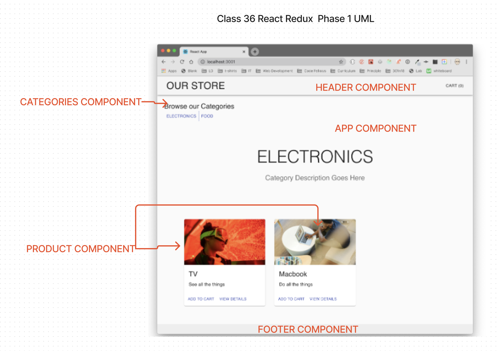

# Virtual Store

An online shopping portal for a fictional store

## Author: Eva Grace Smith

## Business Requirements

Our application will power an online storefront that will allow our users to browse our product offerings by category, place items in their shopping cart, and check-out when they are ready to make their purchase

The core requirements and functionality are as follows:

* Display a list of our product categories
* Display a listing of products for each category, when the category is selected
* From the product listings:
* Click to view a full detail page about the product
* Add the product to your shopping cart
* Shopping cart (simple version) always visible on screen
* Full shopping cart and check out screen available from main navigation

## Technical Requirements

The application will be created with the following overall architecture and methodologies

1. React
2. ES6 Classes
3. Redux Store for Application State
4. Deployed API with MongoDB storage for storing categories and products
5. Superagent or Axios for performing API Requests
6. Material UI for layout and styling
7. Test Driven Development, using Jest
8. Deployment to a cloud provider (Netlify, Amplify, or GitHub Pages)

## Phase 1: Application Setup

* Basic React Application
* Redux State Management
* State managed in memory
* Material UI Components & Styling

In this first phase, our goal is to setup the basic scaffolding of the application with initial styling and basic behaviors. This initial build sets up the file structure and state management so that we can progressively build this application in a scalable manner.

The following user/developer stories detail the major functionality for this phase of the project.

* As a user, I expect to see a list of available product categories in the store so that I can easily browse products.
* As a user, I want to choose a category and see a list of all available products matching that category.
* As a user, I want a clean, easy to use user interface so that I can shop the online store with confidence.

